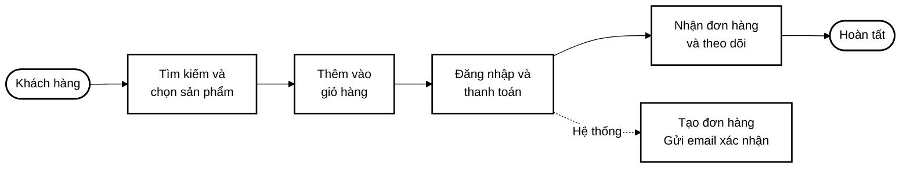

```mermaid
%%{init: {'theme':'base', 'themeVariables': { 'primaryColor':'#ffffff','primaryTextColor':'#000000','primaryBorderColor':'#000000','lineColor':'#000000','secondaryColor':'#ffffff','tertiaryColor':'#ffffff'}}}%%
flowchart LR
    Start([Khách hàng]) --> Step1["Tìm kiếm và<br/>chọn sản phẩm"]
    Step1 --> Step2["Thêm vào<br/>giỏ hàng"]
    Step2 --> Step3["Đăng nhập và<br/>thanh toán"]
    Step3 --> Step4["Nhận đơn hàng<br/>và theo dõi"]
    Step4 --> End([Hoàn tất])
    
    Step3 -.->|Hệ thống| System["Tạo đơn hàng<br/>Gửi email xác nhận"]
    
    classDef defaultStyle fill:#ffffff,stroke:#000000,stroke-width:2px,color:#000000
    class Start,Step1,Step2,Step3,Step4,End,System defaultStyle
```
