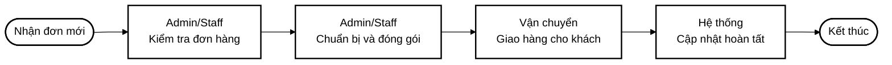

```mermaid
%%{init: {'theme':'base', 'themeVariables': { 'primaryColor':'#ffffff','primaryTextColor':'#000000','primaryBorderColor':'#000000','lineColor':'#000000','secondaryColor':'#ffffff','tertiaryColor':'#ffffff'}}}%%
flowchart LR
    Start([Nhận đơn mới]) --> Step1["Admin/Staff<br/>Kiểm tra đơn hàng"]
    Step1 --> Step2["Admin/Staff<br/>Chuẩn bị và đóng gói"]
    Step2 --> Step3["Vận chuyển<br/>Giao hàng cho khách"]
    Step3 --> Step4["Hệ thống<br/>Cập nhật hoàn tất"]
    Step4 --> End([Kết thúc])
    
    classDef defaultStyle fill:#ffffff,stroke:#000000,stroke-width:2px,color:#000000
    class Start,Step1,Step2,Step3,Step4,End defaultStyle
```
