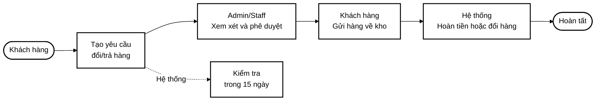

```mermaid
%%{init: {'theme':'base', 'themeVariables': { 'primaryColor':'#ffffff','primaryTextColor':'#000000','primaryBorderColor':'#000000','lineColor':'#000000','secondaryColor':'#ffffff','tertiaryColor':'#ffffff'}}}%%
flowchart LR
    Start([Khách hàng]) --> Step1["Tạo yêu cầu<br/>đổi/trả hàng"]
    Step1 --> Step2["Admin/Staff<br/>Xem xét và phê duyệt"]
    Step2 --> Step3["Khách hàng<br/>Gửi hàng về kho"]
    Step3 --> Step4["Hệ thống<br/>Hoàn tiền hoặc đổi hàng"]
    Step4 --> End([Hoàn tất])
    
    Step1 -.->|Hệ thống| Check["Kiểm tra<br/>trong 15 ngày"]
    
    classDef defaultStyle fill:#ffffff,stroke:#000000,stroke-width:2px,color:#000000
    class Start,Step1,Step2,Step3,Step4,End,Check defaultStyle
```
