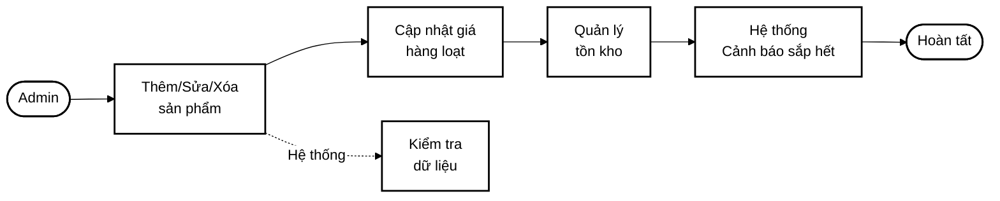

```mermaid
%%{init: {'theme':'base', 'themeVariables': { 'primaryColor':'#ffffff','primaryTextColor':'#000000','primaryBorderColor':'#000000','lineColor':'#000000','secondaryColor':'#ffffff','tertiaryColor':'#ffffff'}}}%%
flowchart LR
    Start([Admin]) --> Step1["Thêm/Sửa/Xóa<br/>sản phẩm"]
    Step1 --> Step2["Cập nhật giá<br/>hàng loạt"]
    Step2 --> Step3["Quản lý<br/>tồn kho"]
    Step3 --> Step4["Hệ thống<br/>Cảnh báo sắp hết"]
    Step4 --> End([Hoàn tất])
    
    Step1 -.->|Hệ thống| Validate["Kiểm tra<br/>dữ liệu"]
    
    classDef defaultStyle fill:#ffffff,stroke:#000000,stroke-width:2px,color:#000000
    class Start,Step1,Step2,Step3,Step4,End,Validate defaultStyle
```
